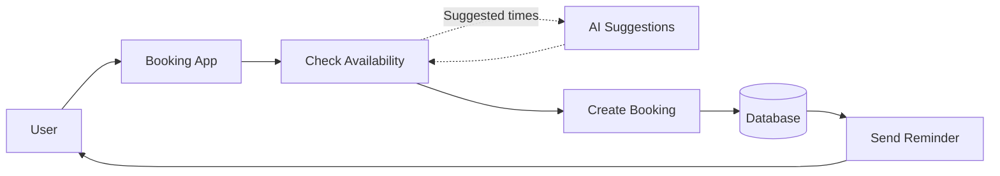

# Architecture — Smart Slot Booking

**Status:** Proposed / Planning Phase  
**Date:** 2026-10-05

---

## System Architecture



---

## Overview

Smart Slot Booking is a scheduling system that allows users to check available slots, create bookings, receive intelligent slot suggestions, and receive reminders.

The system follows a simple core flow:

```text
User
  ↓
Booking App
  ↓
Check Availability
  ↓
Create Booking
  ↓
Database
  ↓
Send Reminder
  ↓
User
```

AI works as a supporting feature during the availability process and can suggest alternative suitable times.

---

## Core Components

| Component | Responsibility |
|---|---|
| **User** | Searches for available slots and creates bookings. |
| **Booking App** | Provides the user interface for viewing and booking slots. |
| **Check Availability** | Determines which slots are currently available. |
| **AI Suggestions** | Suggests suitable alternative times based on available slot information. |
| **Create Booking** | Handles the confirmation and creation of a booking. |
| **Database** | Stores users, schedules, bookings, and related booking information. |
| **Send Reminder** | Sends reminders to users about their bookings. |

---

## Main Booking Flow

The standard booking process is:

```text
User
  ↓
Booking App
  ↓
Check Availability
  ↓
Create Booking
  ↓
Database
```

The availability component determines whether a requested slot can be booked before the booking is created.

---

## Timezone Handling

The system must support users and hosts operating in different timezones.

For example:

```text
Host Timezone
Asia/Kolkata (IST)

        ↓

Availability / Booking Logic

        ↓

Booker Timezone
America/Los_Angeles
```

Booking times should be normalized consistently when performing availability and conflict checks.

The same real-world booking should be displayed in the correct local time for both the host and the booker.

---

## Buffer Time

The availability system must respect the configured buffer between bookings.

For example:

```text
Booking
10:00 ───────── 10:30

Buffer
                 10:30 ───── 10:45

Next Available Slot
                              10:45 ─────
```

A slot that overlaps the required buffer must not be offered as available.

---

## Concurrent Booking Protection

The booking service must prevent two users from successfully booking the same slot at the same time.

The expected behaviour is:

```text
Student A ──────→ Create Booking ──────→ 201 Created
                         │
                         │
Student B ──────→ Same Slot ──────────→ 409 Conflict
```

The database must contain only **one confirmed booking** for the same slot.

Concurrency protection must be handled by the backend/database rather than only by the frontend.

---

## AI Assistance

AI provides supporting functionality without controlling the booking process.

The AI flow is:

```text
Check Availability
        ↓
AI Suggestions
        ↓
Suggested Times
        ↓
User
```

AI suggestions are based on available slot information.

The AI layer must not independently confirm or create bookings.

Any selected suggestion must go through the normal availability and booking flow.

---

## Reminder Flow

Booking information stored in the database can be used to provide reminders.

```text
Database
    ↓
Send Reminder
    ↓
User
```

Reminders help users stay aware of their upcoming bookings.

---

## Key Architectural Principles

### 1. Availability First

The system checks availability before allowing a booking to be created.

### 2. Safe Booking

The booking process must protect against concurrent booking attempts for the same slot.

### 3. Timezone Awareness

Availability and booking calculations must correctly handle different user and host timezones.

### 4. Buffer Enforcement

Required buffer time between bookings must be respected by the booking logic.

### 5. AI as an Assistant

AI provides suggestions but does not control availability or directly create bookings.

### 6. Centralized Data

Booking and scheduling information is stored in the database.

---

## Architecture Summary

```text
                    ┌─────────────────┐
                    │      User       │
                    └────────┬────────┘
                             │
                             ▼
                    ┌─────────────────┐
                    │  Booking App    │
                    └────────┬────────┘
                             │
                             ▼
                    ┌─────────────────┐
                    │ Check Availability│
                    └───────┬─────────┘
                            │
              ┌─────────────┴─────────────┐
              │                           │
              ▼                           ▼
      ┌───────────────┐           ┌────────────────┐
      │ AI Suggestions│           │ Create Booking │
      └───────┬───────┘           └───────┬────────┘
              │                           │
              └───────────┐       ┌───────┘
                          │       │
                          ▼       ▼
                       ┌────────────┐
                       │  Database  │
                       └──────┬─────┘
                              │
                              ▼
                       ┌────────────┐
                       │  Reminder  │
                       └──────┬─────┘
                              │
                              ▼
                            User
```

---

## Killer Test Coverage

The architecture directly supports the three required Killer Tests:

| Killer Test | Architecture Component |
|---|---|
| **Timezone correctness** | Availability & Booking Logic |
| **Buffer enforcement** | Availability Engine |
| **Concurrent booking safety** | Booking Service + Database |
